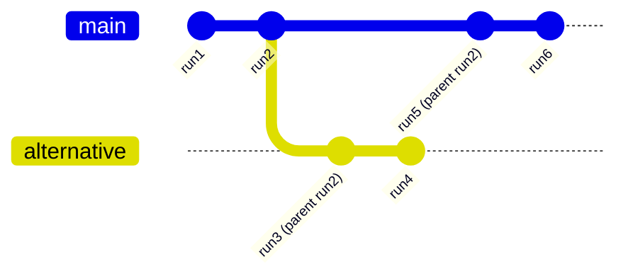

# Serialization

Serialization in AG-UI provides a standard way to persist and restore the event
stream that drives an agent–UI session. With a serialized stream you can:

- Restore chat history and UI state after reloads or reconnects
- Attach to running agents and continue receiving events
- Create branches (time travel) from any prior run
- Compact stored history to reduce size without losing meaning

This page explains the model, the updated event fields, and practical usage
patterns with examples.

## Core Concepts

- Stream serialization – Convert the full event history to and from a portable
  representation (e.g., JSON) for storage in databases, files, or logs.
- Event compaction – Reduce verbose streams to snapshots while preserving
  semantics (e.g., merge content chunks, collapse deltas into snapshots).
- Run lineage – Track branches of conversation using a `parentRunId`, forming
  a git‑like append‑only log that enables time travel and alternative paths.

## Updated Event Fields

The `RunStarted` event includes additional optional fields:

```ts
type RunStartedEvent = BaseEvent & {
  type: EventType.RUN_STARTED
  threadId: string
  runId: string
  /** Parent for branching/time travel within the same thread */
  parentRunId?: string
  /** Exact agent input for this run (may omit messages already in history) */
  input?: AgentInput
}
```

These fields enable lineage tracking and let implementations record precisely
what was passed to the agent, independent of previously recorded messages.

## Event Compaction

Compaction reduces noise in an event stream while keeping the same observable
outcome. A typical implementation provides a utility:

```ts
declare function compactEvents(events: BaseEvent[]): BaseEvent[]
```

Common compaction rules include:

- Message streams – Combine `TEXT_MESSAGE_*` sequences into a single message
  snapshot; concatenate adjacent `TEXT_MESSAGE_CONTENT` for the same message.
- Tool calls – Collapse tool call start/content/end into a compact record.
- State – Merge consecutive `STATE_DELTA` events into a single final
  `STATE_SNAPSHOT` and discard superseded updates.
- Run input normalization – Remove from `RunStarted.input.messages` any
  messages already present earlier in the stream.

## Branching and Time Travel

Setting `parentRunId` on a `RunStarted` event creates a git‑like lineage. The
stream becomes an immutable append‑only log where each run can branch from any
previous run.



Benefits:

- Multiple branches in the same serialized log
- Immutable history (append‑only)
- Deterministic time travel to any point

## Examples

### Basic Serialization

```ts
// Serialize event stream
const events: BaseEvent[] = [...];
const serialized = JSON.stringify(events);

await storage.save(threadId, serialized);

// Restore and compact later
const restored = JSON.parse(await storage.load(threadId));
const compacted = compactEvents(restored);
```

### Event Compaction

Before:

```ts
[
  { type: "TEXT_MESSAGE_START", messageId: "msg1", role: "user" },
  { type: "TEXT_MESSAGE_CONTENT", messageId: "msg1", delta: "Hello " },
  { type: "TEXT_MESSAGE_CONTENT", messageId: "msg1", delta: "world" },
  { type: "TEXT_MESSAGE_END", messageId: "msg1" },
  { type: "STATE_DELTA", patch: { op: "add", path: "/foo", value: 1 } },
  { type: "STATE_DELTA", patch: { op: "replace", path: "/foo", value: 2 } },
]
```

After:

```ts
[
  {
    type: "MESSAGES_SNAPSHOT",
    messages: [{ id: "msg1", role: "user", content: "Hello world" }],
  },
  {
    type: "STATE_SNAPSHOT",
    state: { foo: 2 },
  },
]
```

### Branching With `parentRunId`

```ts
// Original run
{
  type: "RUN_STARTED",
  threadId: "thread1",
  runId: "run1",
  input: { messages: ["Tell me about Paris"] },
}

// Branch from run1
{
  type: "RUN_STARTED",
  threadId: "thread1",
  runId: "run2",
  parentRunId: "run1",
  input: { messages: ["Actually, tell me about London instead"] },
}
```

### Normalized Input

```ts
// First run includes full message
{
  type: "RUN_STARTED",
  runId: "run1",
  input: { messages: [{ id: "msg1", role: "user", content: "Hello" }] },
}

// Second run omits already‑present message
{
  type: "RUN_STARTED",
  runId: "run2",
  input: { messages: [{ id: "msg2", role: "user", content: "How are you?" }] },
  // msg1 omitted; it already exists in history
}
```

## Implementation Notes

- Provide SDK helpers for compaction and (de)serialization.
- Store streams append‑only; prefer incremental writes when possible.
- Consider compression when persisting long histories.
- Add indexes by `threadId`, `runId`, and timestamps for fast retrieval.

## See Also

- Concepts: [Events](/concepts/events), [State Management](/concepts/state)
- SDKs: TypeScript encoder and core event types

